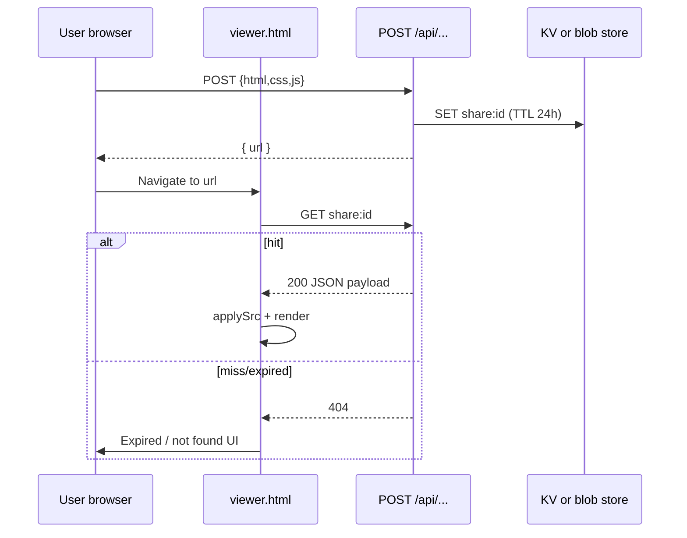

# feat: Viewer hosted ephemeral share (24h short links)

## Overview

Add **server-backed, short-lived share links** so recipients open a **normal-length URL** that loads the same HTML/CSS/JS into `viewer.html`’s existing pipeline, with a **24-hour TTL**, **size caps**, **rate limits**, and **basic usage logging**. This is **Tier 1** from the origin document; **Tier 0** (**Download HTML** + `#code=` share) is already shipped in v2.13.7 (see `CHANGELOG.md`).

**Origin document:** [docs/brainstorms/2026-06-01-viewer-download-hosted-share-requirements.md](../brainstorms/2026-06-01-viewer-download-hosted-share-requirements.md) — carried forward: R3–R6, success criteria, scope boundaries, Tier 1 vs Tier 2 split, privacy “anyone with link” for MVP, deferred technical questions on max payload/CSP/store choice (see §Technical considerations).

## Problem statement / motivation

`#code=` links embed the full payload and become **long or brittle** in SMS, some email clients, and chat tools (see origin problem frame). A **short id** fetched at view time fixes UX without asking non-technical users to paste code. **Download HTML** already helps email attachment use cases; hosted links complement when attachments are awkward but URLs must stay short.

## Proposed solution (high level)

1. **Write path:** Authenticated-less **POST** accepts a JSON body `{ html, css, js }` (same shape as `hibot-share` / viewer tabs). Server validates size, applies rate limit, stores payload (or a pre-assembled preview document string) under an unguessable id with **24h expiry**, returns `{ url }` pointing at the viewer (or a thin redirect page).
2. **Read path:** `viewer.html` (or `viewer.html?share=<id>`) on load **fetches** the blob; on success applies the same `applySrc` / `render` path as `fromShareLink`; on 404/expired shows **R4 expiry UX** (clear message + CTA to `viewer.html`).
3. **Coexist:** Keep **Share** (`#code=`) and **Download HTML** unchanged for privacy and zero-backend use. New control e.g. **“Short link (24h)”** or auto-offer when URL length exceeds a threshold (product choice during implementation).

## Technical considerations

- **Stack today:** `hibot-code` is a **static** site (`vercel.json`: `framework: null`, `outputDirectory: "."`). Adding hosted shares requires **Vercel Serverless/Edge Functions** (or an external API) plus **durable storage with TTL** — not static-only (see origin Dependencies).
- **Payload shape:** Reuse `{ html, css, js }` strings as in `viewer.html` / `assets/hibot-share.js` so `buildDoc()` stays the single render assembler (see origin: “same render pipeline”).
- **Size limits:** Align with editor share guardrails (**warn ~150 KB raw, block ~400 KB raw**) unless ops chooses stricter for first launch (see origin Deferred: max payload).
- **Security / abuse:** Rate limit **per IP** (and optionally per fingerprint cookie) on POST; cap request body; consider **Content-Security-Policy** on the viewer when loading remote share metadata; **no** server-side execution of user JS — only storage + delivery. Document **R6**: anyone with the URL can read the snippet (MVP).
- **Logging (R5):** Structured logs or metrics: `POST` count, `GET` hit/miss, bytes stored, 429 count. Enough to judge a future **Tier 2** ~$5/mo longer TTL (origin — no billing in this plan).
- **PWA / cache:** New API routes must not be over-cached by global `no-store` headers on static assets; ensure **API responses** use appropriate `Cache-Control: private, no-store` and **do not** put dynamic share content in `sw.js` `CORE_ASSETS`.

## System-wide impact

| Area | Impact |
|------|--------|
| **viewer.html** | New boot branch: query `share=` / path `/v/:id` → fetch → merge with existing `fromShareLink` / `localStorage` precedence (define order: hosted param > hash > localStorage > STARTER). |
| **editor.html** | Optional: “Short link” when share URL too long; must reuse same API contract. |
| **vercel.json / env** | New `api/` handlers; env vars for KV/store (names only in docs, never commit secrets). |
| **Deploy / CI** | If GitHub Pages stays static-only for a fork, hosted feature **cannot** live there without a separate backend — confirm **production** is Vercel (already suggested by `vercel.json`). |

**Error propagation:** POST returns 413/429/400 with JSON `{ error, code }`; viewer surfaces human-readable strings.

**State lifecycle:** TTL is the only GC; no orphan cleanup beyond store TTL.

## Alternative approaches considered

| Approach | Pros | Cons | Verdict |
|----------|------|------|---------|
| **URL shortener + same long hash** | No server storage | Still huge server-side redirect targets; many shorteners reject long URLs | Reject |
| **Pastebin third-party API** | Fast | Privacy, branding, rate limits out of our control | Defer |
| **First-party KV + Vercel function** | Fits current host, TTL native in KV | New cost + env setup | **Preferred** for Tier 1 |

## Acceptance criteria

- [ ] **AC1:** From the viewer, user can obtain a **short URL** (path + query length bounded, e.g. &lt; 120 chars total excluding origin) that opens the **same rendered output** as current tabs for the stored snapshot.
- [ ] **AC2:** Share content **expires** after **24 hours** (± clock skew documented); **GET** returns 404 afterward; viewer shows **R4** copy + link back to empty viewer.
- [ ] **AC3:** **POST** rejects payloads over the chosen max bytes with clear error; **429** when rate limited.
- [ ] **AC4:** **R5:** Documented metrics or log fields exist for POST/GET volume and payload size (even if initially console/log drain only).
- [ ] **AC5:** **R6** disclosed in UI copy near the new control (“Anyone with the link can view this code until it expires”).
- [ ] **AC6:** Existing **Share** (`#code=`) and **Download HTML** continue to work with no regression.
- [ ] **AC7:** No secrets in repo; rotation instructions for any leaked test keys (names only in plan).

## Success metrics (from origin)

- Ops can report **hosted blobs/day**, **average stored size**, **bandwidth** (or request counts as proxy).
- Viewer **TTI** for users who never use hosted links remains **unchanged within noise** (no blocking fetch on default load).

## Dependencies & risks

| Dependency | Risk | Mitigation |
|------------|------|------------|
| Vercel KV (or alternative) provisioned | Misconfig blocks deploy | Staging env + smoke test before prod |
| Cost at traffic spike | Bill surprise | Hard caps + alerts (document in runbook) |
| Abuse (POST spam) | Cost + noise | Rate limits + optional Turnstile later (out of MVP unless required) |

## Implementation phases

### Phase A — API + storage skeleton

- Add `api/` route(s): `POST` create, `GET` read by id (or single route with method routing per Vercel convention).
- Wire **Vercel KV** (or chosen store) with TTL = 86400 seconds on key.
- Unit or integration tests runnable locally with **mock store** or Vercel dev.

### Phase B — Viewer integration

- Extend `viewer.html` boot: parse `?share=` (or agreed param), fetch GET, on success `applySrc` + `render`; on failure show expiry panel (reuse styles from `.toolbar` / `.hint`).
- Add toolbar button + `makeFlasher` / tooltip pattern consistent with Share/PDF/Download.
- Bump **VERSION** + `sw.js` `CACHE_NAME` if viewer ships to PWA users; update `CHANGELOG.md`.

### Phase C — Polish & ops

- Editor: optional entry point + same size warnings as hash share.
- **Docs:** Short “Privacy & expiry” note in `CHANGELOG` or a one-pager under `docs/`.
- **Monitoring:** If using Vercel Analytics or Log Drain, document where to read POST/GET counts.

## Spec-flow / edge cases (consolidated)

- **Double source:** User opens `viewer.html?share=id` **and** `#code=` — define precedence (recommend: **query wins** for explicit share, then hash, then localStorage).
- **Edit after load:** Same as today: editing clears hash; hosted load should set a flag so **refresh** does not re-fetch unexpectedly, or replace query with history API for clean URL (product detail).
- **Offline PWA:** Fetch fails — show “needs network” vs “expired” when status 0 vs 404.
- **Crawler:** GET should not execute user JS server-side; response is JSON only; **OG unfurl** not required (origin scope boundary).

## Documentation plan

- `CHANGELOG.md` entry for feature + version bump.
- Optional: one paragraph in site FAQ or viewer hint linking to expiry/privacy.

### External references (deepen pass)

- [Vercel Functions limitations](https://vercel.com/docs/functions/limitations) — 4.5 MB body limit.
- [Upstash Redis `SET` with expiration](https://upstash.com/docs/redis/sdks/ts/commands/string/set) — `{ ex: seconds }` for 24h TTL.

## Sources & references

- **Origin document:** [2026-06-01-viewer-download-hosted-share-requirements.md](../brainstorms/2026-06-01-viewer-download-hosted-share-requirements.md) — R3–R6, Tier 1/2, success criteria, privacy stance.
- **Existing share codec:** `hibot-code/assets/hibot-share.js` — `encodeCode` / `decodeCode` / `buildViewerUrl`.
- **Viewer boot + render:** `hibot-code/viewer.html` — `fromShareLink`, `buildDoc`, `load`, share button.
- **Editor size guards:** `hibot-code/editor.html` — `WARN_BYTES` / `BLOCK_BYTES` (~9171+).
- **Deploy:** `hibot-code/vercel.json`, `.github/workflows/deploy.yml` (GitHub Pages path — confirm which surface serves `code.hibot.space`).

## Deepened research (post-plan pass)

- **Vercel function payload:** Request and response bodies are capped at **4.5 MB** per function invocation; larger requests return **413** (`FUNCTION_PAYLOAD_TOO_LARGE`). Our **400 KB raw** editor cap keeps POST/GET well inside this band with JSON overhead. Official overview: [Vercel Functions limits](https://vercel.com/docs/functions/limitations).
- **TTL storage:** Prefer **Redis-compatible** storage with `SET … EX` / `set(key, value, { ex: seconds })` (Upstash Redis SDK) so keys auto-expire without a sweeper. Vercel’s older “KV” branding has moved toward **Upstash via Marketplace**; plan provisioning as “Redis on Vercel” / Upstash to avoid deprecated naming. Reference: [Upstash `SET` with `ex`](https://upstash.com/docs/redis/sdks/ts/commands/string/set).
- **Rate limiting:** Upstash supports atomic patterns for fixed-window or sliding limits; alternative is **Vercel Edge Middleware** + in-memory is weak on serverless — prefer **Redis INCR** with TTL per IP key prefix `rl:share:<ip>` for MVP.
- **GET response size:** Same **4.5 MB** cap applies to responses; if a stored blob approaches the cap, return **413** on POST at a lower internal cap (e.g. **1 MB** stored JSON) as defense-in-depth.

## Deferred (from origin — planning research, not blockers)

- Exact **CSP** / sanitization policy vs current iframe sandbox (stricter only if product requires).
- **Store choice** final sign-off: **Upstash Redis** (recommended for TTL + rate limit) vs **Vercel Blob** (better if later moving to presigned direct upload >4.5MB — out of scope for MVP). Spike in Phase A.

## Pre-implementation checklist

- [ ] Confirm **production host** supports serverless + chosen store (see Sources).
- [ ] Create **staging** KV namespace and env vars on Vercel project.
- [ ] Define **URL shape** (`/api/share/:id` + viewer query vs `/v/:id` rewrite) and document in PR.
